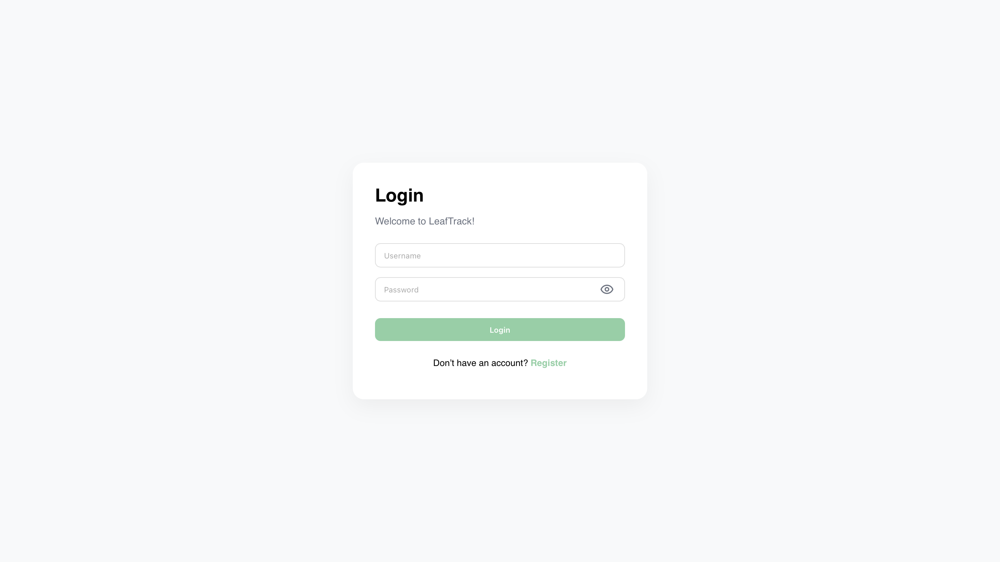
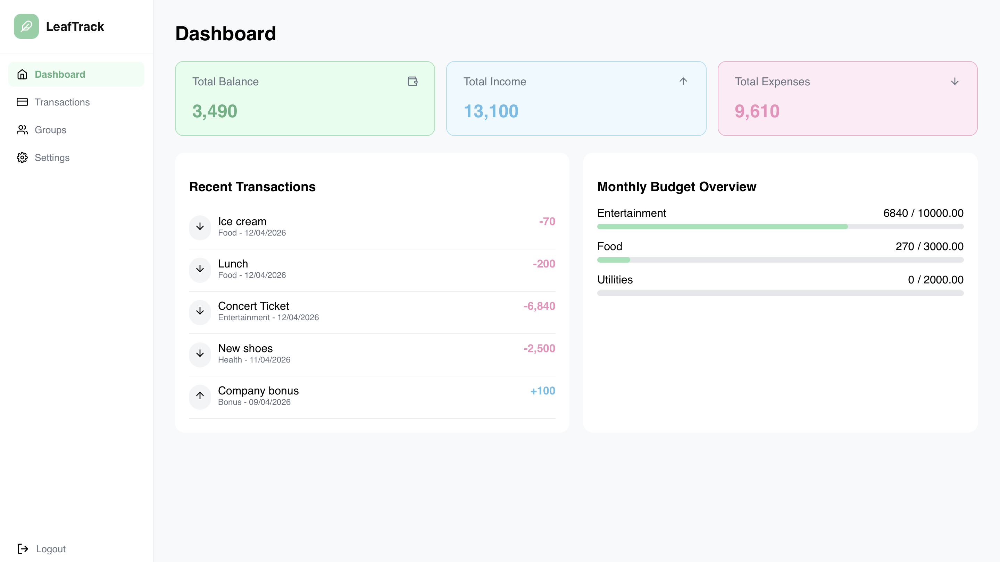
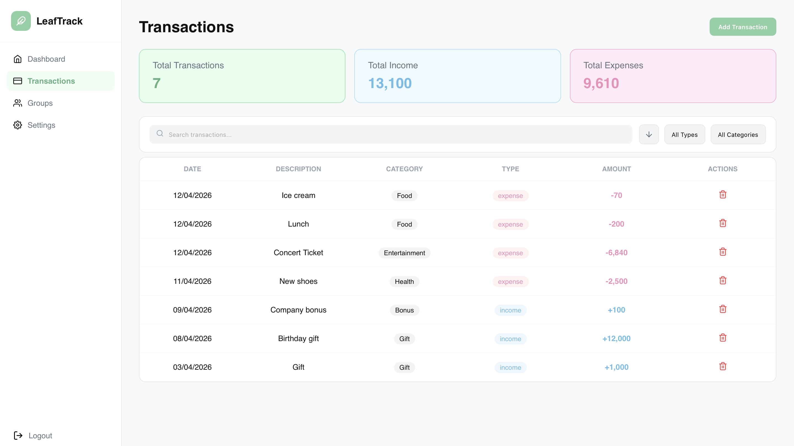
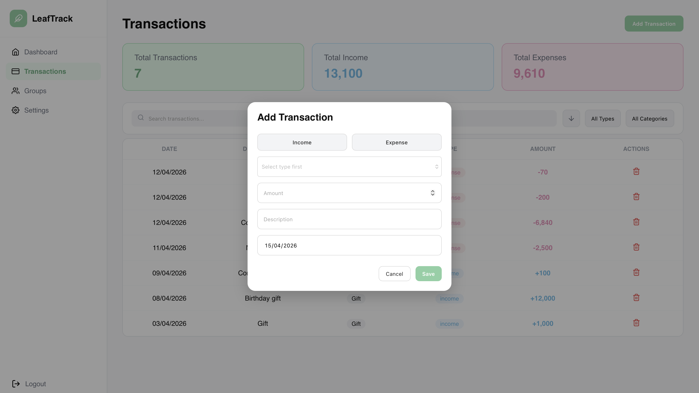
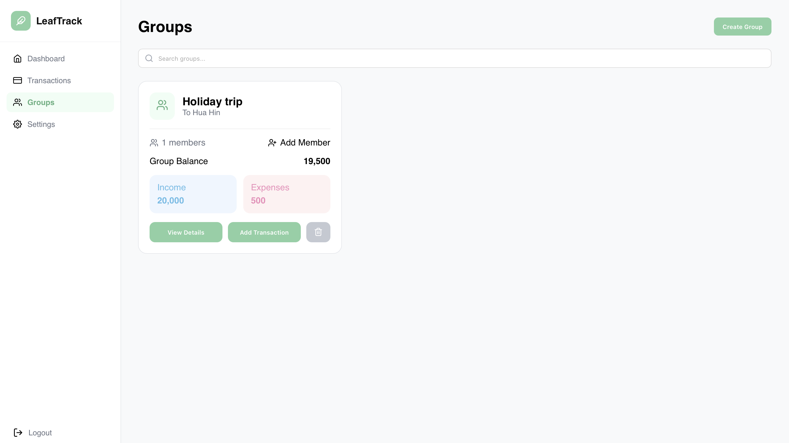
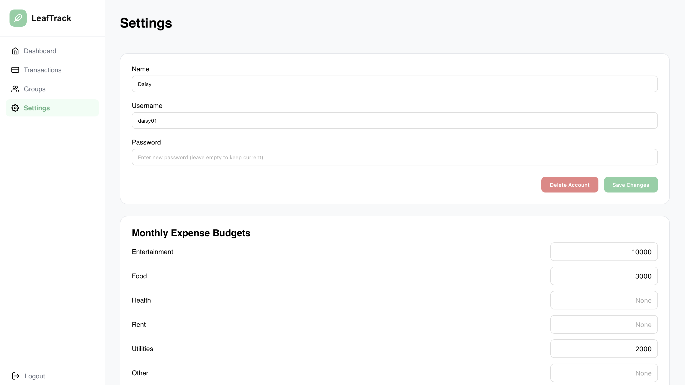
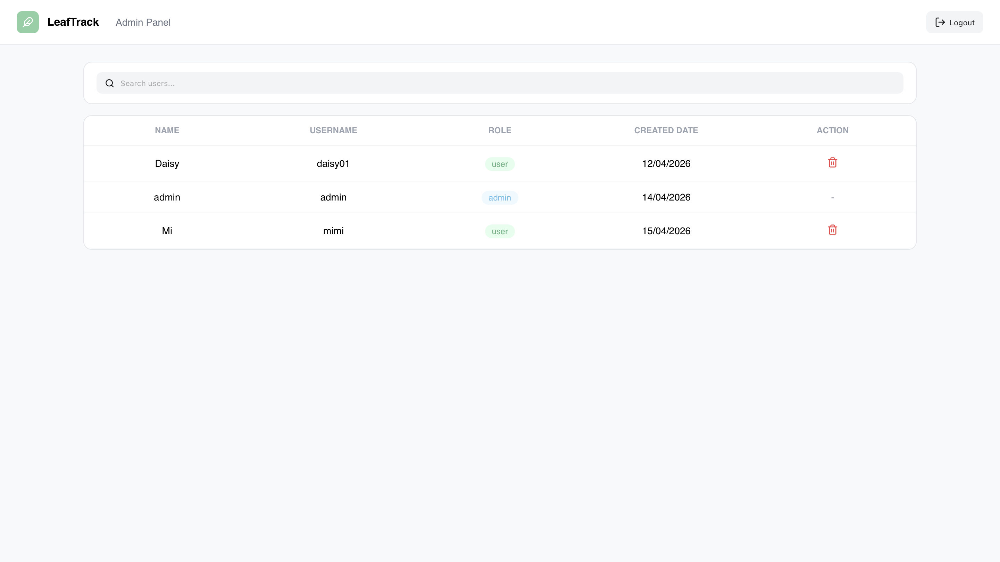

# Leaf Track - Expense & Income Tracker

## Project Description

Leaf Track is an expense and income tracker designed to help personal and groups manage financial activity. The application enables users to record income and expenses, categorize transactions, set monthly budgets, monitor remaining balance, and share a workspace with others.

## System Architecture Overview

Leaf Track is built using a layered architecture style:

- **Presentation Layer**: React.js frontend for user interaction.
- **Application Layer**: Express.js routes expose REST endpoints for users, workspaces, transactions, budgets, and categories.
- **Business Logic Layer**: Services implement workflow rules, budget calculations, and data validation.
- **Data Access Layer**: Handle PostgreSQL queries.
- **Database Layer**: PostgreSQL stores users, workspaces, transactions, budgets, and category data.

## User Roles & Permissions

- **Owner**
  - Creator of a personal or group workspace.
  - Manages group settings and members.
  - Adds and deletes transactions.
  - Sets monthly budget limits.

- **Member**
  - Participates in a group workspace.
  - Adds income and expense records.
  - Edits their own transactions.
  - Views financial summaries.

- **Admin**
  - View all registered user accounts
  - Deactivate user accounts

## Core Features

- User registration and login authentication
- Automatic creation of a personal workspace
- Creation and management of group workspaces for shared financial tracking
- Group invitation system for adding and managing members
- Income and expense transaction recording for both personal and group workspaces
- Ability to edit and delete transactions with category tagging and descriptions
- Budget limit setting with remaining balance tracking
- Financial summaries showing income, expenses, and overall balance overview

## Technology Stack

- Frontend: **React.js**
- Backend: **Node.js** + **Express**
- Database: **PostgreSQL**

## Installation & Setup Instructions

### Prerequisites

- Node.js and npm installed
- PostgreSQL installed and running
- Git installed

### Clone the repository

```bash
git clone https://github.com/your-username/LeafTrack.git
cd LeafTrack
```

### Backend setup

```bash
cd backend
npm install
```

Create a `.env` file in the `backend` folder with the following content:

```env
DATABASE_URL=postgres://<username>:<password>@<host>:<port>/<database>
PORT=4000
```

Initialize the database schema:

```bash
npm run db:init
```

### Frontend setup

```bash
cd ../frontend
npm install
```

## How to Run the System

### Start the backend server

```bash
cd backend
npm run dev
```

The backend API will run by default on `http://localhost:4000`.

### Start the frontend application

```bash
cd frontend
npm start
```

The React application will run by default on `http://localhost:3000`.

## Screenshots
### User







### Admin

